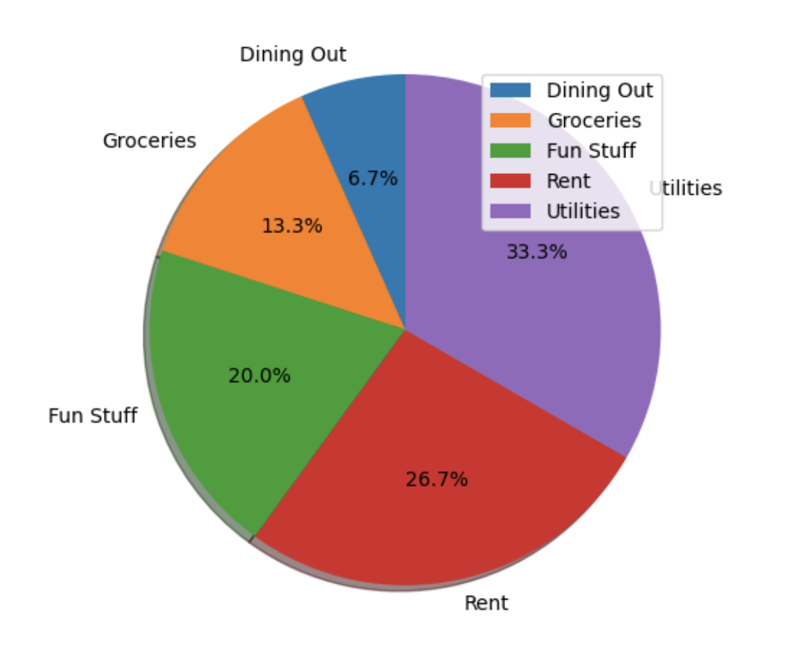

# CS 361 - Final Project

By Carly Coccaro

## About

My final project for CS 361 is called The Receipe Box. It's a console application that scrapes recipe data from websites and returns it to the user.
The application is written in Golang and contains a Python microservice written by my partner, James Cohrs.

## Partner Communication Contract

The following is a communication contract between myself and my group partner. This contract explains the functionality of a microservice that I have created for his final project. This microservice will be added directly to his console application.

This microservice connects to his program via a local socket connection. His application and the microservice will connect to a specified port on the local machine. The microservice will then listen and wait for data to be sent via the port.

The main program will construct a Python dictionary of key/value pairs.

```
# Sample dictionary being sent to microservice
dataDict = {
    "Dining Out": 1,
    "Groceries": 2,
    "Fun Stuff": 3,
    "Rent": 4,
    "Utilities": 5
}
```

This dictionary will then be encoded to JSON and sent over the socket connection. When the microservice receives this data, it will decode the JSON and retrieve the dictionary values. The microservice will pull the dictionary data into separate lists and then send those lists to the CreatePieChart() function. This function will then create a visual representation of the data using the Python Matplot library and create a pop-up window displaying a pie chart of the data.



This functionality (create dictionary -> send data -> create pie chart) can be done multiple times for each budget created by the user. The microservice will complete with the application has ended.

### UML Sequence Diagram


